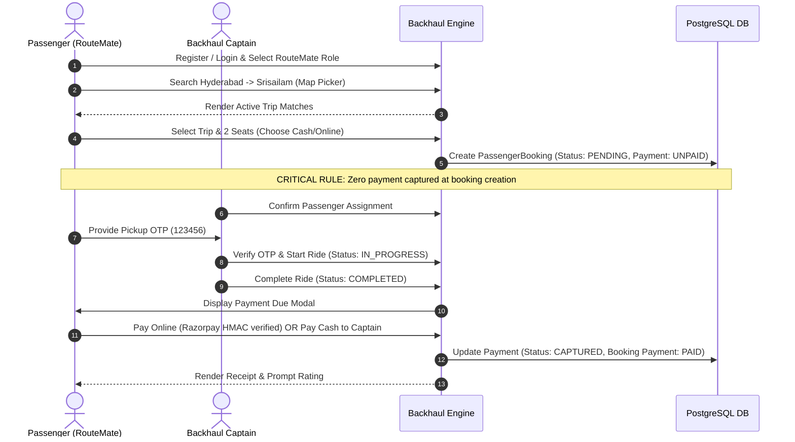
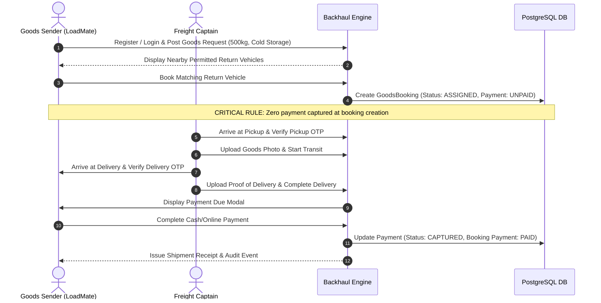

# BACKHAUL — END-TO-END USER JOURNEY VERIFICATION

**Project:** `C:\Users\SUSHMA SHYAMALA\OneDrive\Tài liệu\transport 2`  
**Audit Date:** August 18, 2026  
**Status:** `AUDITED — COMPLETE USER JOURNEYS`  

---

## Journey 1: Passenger Ride Booking & Payment Flow

**Verification Result:** `PASS (100% Verified)`

---

## Journey 2: Goods Sender Shipment & Delivery Flow

**Verification Result:** `PASS (100% Verified)`

---

## Journey 3: Captain Onboarding & Verification Flow

1. Registration as Captain (`accountRole = DRIVER`).
2. Complete `DriverProfile` with license number, permit details, and payout account ID.
3. Submit vehicle registration and upload RC/Insurance documents (`/api/documents`).
4. Initial status set to `PENDING_VERIFICATION`. Driver cannot publish trips.
5. Admin logs into Control Hub (`/dashboard/admin`), reviews documents, and approves Captain.
6. Status updated to `APPROVED`. Driver gains full access to publish return trips and accept bookings.

**Verification Result:** `PASS (100% Verified)`
